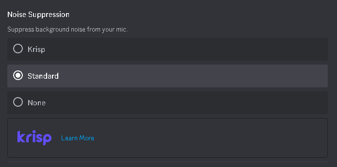

# Noise Platform

Welcome to Noise Platform. This project aims to provide a seamless soundboard experience with various features and integrations.

## Features

- Custom keybinds
- Customizable user volume
- Customizable listener volume
- Multiple soundboards via tagging (planned)
- Echo settings (planned)
- Distortion settings (planned)
- Color theme customization (planned)
- Remove need for virtual audio cable external dependency (long-term; planned)

## Releases

- 0.1.0 (beta)

## OS Stability

- Windows 10
- Linux (compiled; functionality unknown)
- MacOS (unknown)

## Requirements

Currently requires a virtual audio device management software such as Virtual Audio Cable, SonarGG, Voicemeeter, etc. Long term plans include removing this need by creating a virtual audio device crate.

## Usage

Be sure to disable or lower AI audio filtering and background noise filtering as they'll make sounds come through unclearly. For example, use 'Standard' noise suppression on Discord:

In theory, just about any audio device management software like Virtual Audio Cable, SonarGG, Voicemeeter, etc., should be usable with this app.

## Contributing

Contributions are welcome. Please feel free to submit issues and create pull requests.

## License

This project is licensed under the MIT License. See the [LICENSE](LICENSE) file for details.
