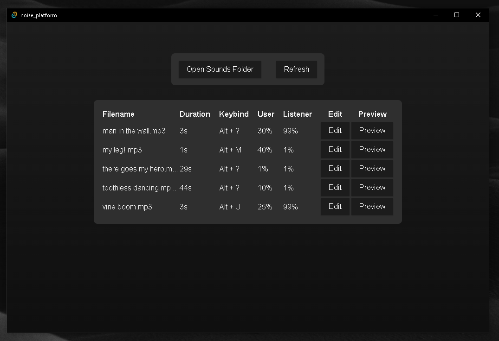

# NOISE PLATFORM

Rather than purchasing a soundboard, this was created as a fun project to experiment with rust on the desktop. Its basic and not very idiomatic, but has been a blast to make and mess around with friends.

## Setup

My current setup for running this app is Windows 10 OS, with SteelSeries' SonarGG Software for managing audio devices.

Be sure to disable or lower AI audio filtering and background noise filtering as they'll make sounds come through unclearly. For example, use 'Standard' noise suppression on Discord:

**In theory**, just about any audio device management software like Virtual Audio Cable, SonarGG, Voicemeeter, etc. should be usable with this app.

## Ideas

- [x] Icons for the desktop app
- [x] Downloadable desktop app
- [ ] Categorization of sounds into different boards. We can use a tagging system so a sound can appear in multiple boards
- [ ] Need to refactor for better variable naming
- [ ] Pass errors returned in the backend to the frontend and display them as little popups in the corner
- [x] ! Large refactor to use tauri `State` to keep track of the settings file. This will include the input/output audio devices, as well as sound files, keybinds, volumes, etc
- [ ] ! BUG: Sounds can be attempted to be played via keybind even if not available in the noise platform sounds folder
- [ ] ? Echo setting
- [ ] ? Distortion setting
- [ ] Customizable color theme settings
