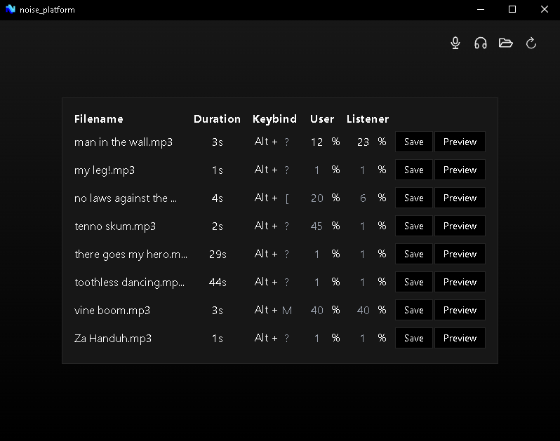

# NOISE PLATFORM

## A soundboard written in Rust + TypeScript

Rather than purchasing a soundboard, this was created as a fun project to experiment with rust on the desktop. Its basic and not very idiomatic, but has been a blast to make and mess around with friends.

Feel free to contribute!

## Setup

My current setup for running this app is Windows 10 OS, with SteelSeries' SonarGG Software for managing audio devices.

Be sure to disable or lower AI audio filtering and background noise filtering as they'll make sounds come through unclearly. For example, use 'Standard' noise suppression on Discord:

**In theory**, just about any audio device management software like Virtual Audio Cable, SonarGG, Voicemeeter, etc. should be usable with this app.

## Stack

Backend

- `Tauri` as the desktop executable
- `cpal` crate for streaming audio to audio input devices (virtual audio cable / microphone)
- `rodio` crate for streaming audio to audio output device

Frontend

- `React` for rendering the UI
- `Typescript` for rough type-matching to Rust equivalents
- `Tailwind CSS` for styling because its convenient

## Complete

- Button to open "Noises" folder
- Button to list available "noise" files
- Get file duration
- Map keybinds (and save them so they persist between app open/close)
- Button to preview listening to the sound
- Make existing keybinds visible in the frontend on initial app open
- Play the sound through the mic at same time as it plays in headphones
- Volume settings
- Keyboard listener thats active while the app is open, that plays sound when keybind pressed
- ! Add setting for tracking user vs listener volume. Update structs / interfaces, frontend state, and backend object construction accordingly.

## Ongoing

- ? Customizable color theme settings
- ? Compilation to Linux Distros via WSL
- ? Ability to manually configure audio input and output devices
- ? Create util function to grab the desktop dir and settings.json file
- Check sounds folder after the prompt window closes to refresh all mp3s in the app

## Disclaimer

**I'm not responsible for any injury or hearing loss caused by this app!**
_There are volume settings for the sounds that you load, but user discretion is required to prevent playing sounds too loudly for yourself or other listeners._
